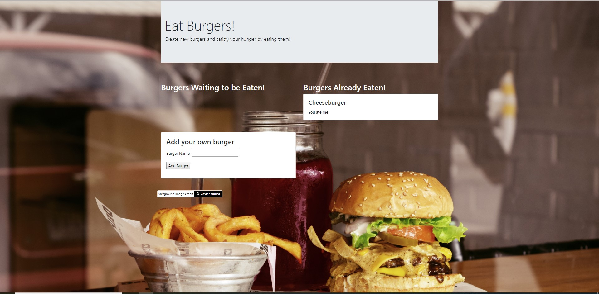
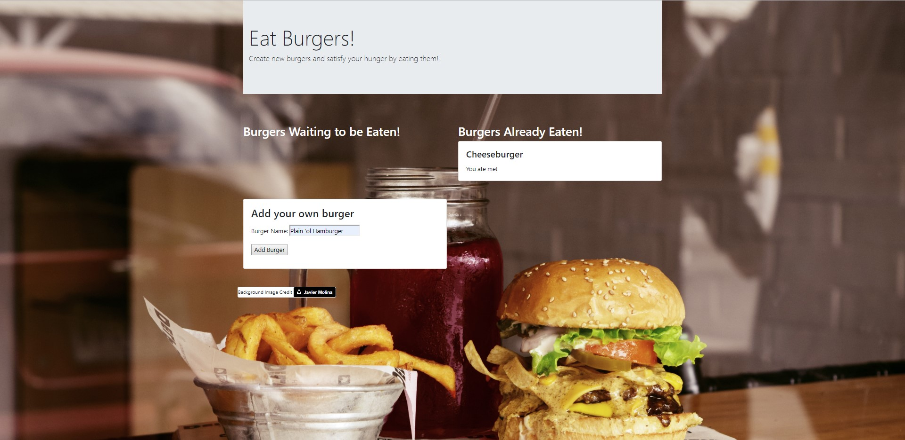
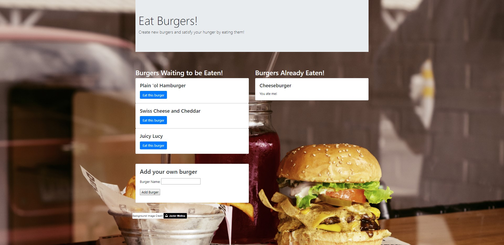
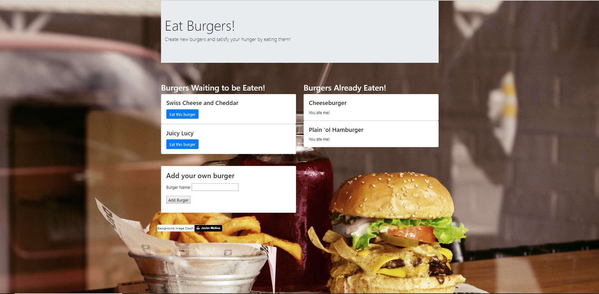
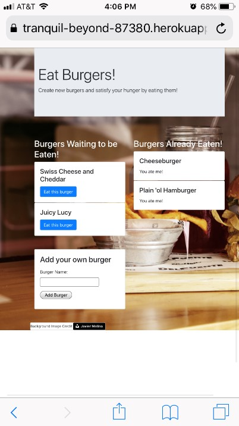

# Burger Town Party

## Overview

Eat Burgers is a web based Javascript app that utilizes Handlebars and interacts with a Jaws DB MySQL database stored on Amazon AWS database. This app allows users to add any desirable burger to the column of burgers waiting to be eaten and displays them in a specific template as individual cards. On each of these cards, there is a button available for the user to 'eat' it and add to the burgers already eaten column and display them as individual cards in another predefined template.

**Purpose:**

Demonstrate how handlebars can be used in conjunction with html and javascript to write cleaner, more readable code.

**Technologies:** Handlebars, MySQL, Bootstrap, jQuery, Ajax

## External Links

The code repository is stored on GitHub [here](https://github.com/peterwra/burger).

To access the Heroku hosted application, click [here](https://tranquil-beyond-87380.herokuapp.com/).

## Views

Hungry? Let's eat some hamburgers!

Enter name of any burger you are hungry for in the 'Add your own burger' textbox and click on the button 'Add Burger'.

Now you can see that I added some of my favorite burgers. They are now displayed as templated individual cards which contains a title (burger name) and a blue 'Eat this burger' button below it.

Eat a burger by clicking on 'Eat this burger' button, then it will be displayed as individual cards in a different template which has name on the top and context 'You ate me!' below it in the column on the right side of the webpage.

You can play this on your mobile devices as well; Bootstrap has been utilized so that the page layout is automatically adjusted to fit the resolution and screen size of your device.

